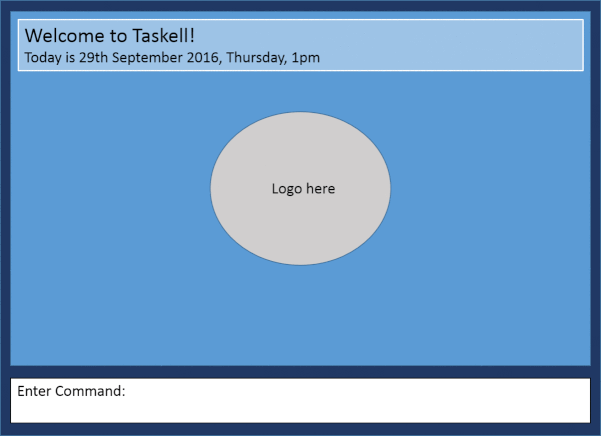

# User Guide

* [Quick Start](#quick-start)
* [Features](#features)
* [FAQ](#faq)
* [Command Summary](#command-summary)

## Quick Start

0. Ensure you have Java version `1.8.0_60` or later installed in your Computer. 
   > Having any Java 8 version is not enough.  
   This application will not work with earlier versions of Java 8.
   
1. Download the latest `taskell.jar` from here.
2. Copy the file to the folder you want to use as the home folder for your task manager.
3. Double-click the file to start the application. The GUI should appear in a few seconds. 
   > 

4. Type the command in the command box and press <kbd>Enter</kbd> to execute it.  
    >  
   e.g. typing **`list today`** and pressing <kbd>Enter</kbd> will list the tasks of today.
5. Some example commands you can try:
   * **`list`** : lists all contacts
   * **`add`** `add buy MA1101R textbook today` : adds a task called “buy MA1101R textbook” to be done by today
   * **`delete`**` 3` : deletes the 3rd task shown in the current list
   * **`exit`** : exits the application
6. Refer to the [Features](#features) section below for details of each command. 

## Features

> **Command Format**
> * Words in `UPPER_CASE` are the parameters.
> * Items in `SQUARE_BRACKETS` are optional.
> * Items with `...` after them can have multiple instances.
> * The order of parameters is fixed.

#### Viewing help : `help`
Format: `help`

> Help is also shown if you enter an incorrect command e.g. `abcd`
 
#### Adding a person: `add`
Adds a task to Taskell. 
Format: `add TASK ITEM [DATE]` 

> Dates can be added as “today”, “tomorrow”, “5th October”

Examples: 
* `add buy MA1101R textbook today`
* `add do CS2100 assignment by 10th August`

#### Listing all persons : `list`
Shows a list of all persons in Taskell. 
Format: `list`

#### Finding all tasks containing any keyword in their name: `find`
Finds tasks whose names contain any of the given keywords. 
Format: `find KEYWORD [MORE_KEYWORDS]`

> * The order of the keywords does not matter. e.g. `chicken egg` will match `egg chicken`
> * Only the task item is searched, not the tags.
> * Only full words will be matched e.g. `chicken` will not match `chickens`
> * Taskss matching at least one keyword will be returned (i.e. `OR` search).
    e.g. `chicken` will match `chicken duck`

Examples: 
* `find banana` 
  Returns ` buy bananas by 16th Feb`
* `find banana milk essay` 
  Returns Any task having words `banana`, `milk`, or `essay`
  

#### Deleting a person : `delete`
Deletes the specified task from Taskell. Can be reversed via undo, but only if no new commands are entered after deleting. 
Format: `delete INDEX`

> Deletes the person at the specified `INDEX`. 
  The index refers to the index number shown in the most recent listing. 
  The index **must be a positive integer** 1, 2, 3, ...

Examples: 
* `list` 
  `delete 2` 
  Deletes the 2nd task in Taskell.
* `find violin`  
  `delete 1` 
  Deletes the 1st task in the results of the `find` command.

#### Editing an entry : `edit`
Edit the specified task in Taskell. 
Format: `edit INDEX read lord of the rings`

Examples:
* `list` 
* `edit 2` 
Edits the 2nd task in Taskell to “read lord of the rings”. 

#### Clearing all entries : `clear`
Clear all entries in Taskell. 
Format: `clear`  

#### Exiting the program : `exit`
Exits the program. 
Format: `exit`  

#### Saving the data 
Address book data are saved in the hard disk automatically after any command that changes the data. 
There is no need to save manually.

## FAQ

**Q**: How do I transfer my data to another Computer? 
**A**: Install the app in the other computer and overwrite the empty data file it creates with 
       the file that contains the data of your previous Taskell folder.
       
## Command Summary

Command | Format  
-------- | :-------- 
Add | `add TASK ITEM [DATE]`
Clear | `clear`
Delete | `delete INDEX`
Edit | `edit INDEX NEWTASK`
Exit | `exit`
Find | `find KEYWORD [MORE_KEYWORDS]`
List | `list`
Help | `help`
